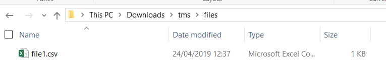
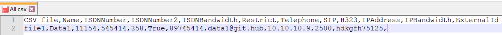
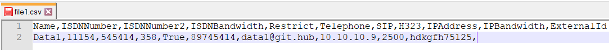

# Create individual CSV files from a master CSV file - User guide
You will need to edit the All.csv with your needs.

## Dependencies
>None

## info.csv
>Details explaining each column
* **CSV_file**: Keep the header as it is. The data in this header will be used to create file name. It won't be used as header for the new CSV file
* **the rest**: Can be modified to meet your needs.

