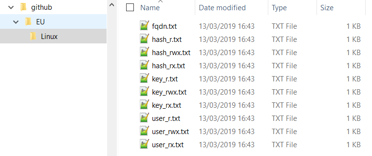
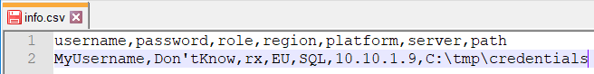

# Create Login Credential - User guide
You will need to edit the info.csv with your details and edit Create_login.py FILE variable with the location of the info.csv

## Dependencies
>cryptography module

## info.csv
>Details
* **username**: The username you will be using to log on your system
* **password**: The password you will be using to log on your system
* **role**: The permission of your account. The role will help to build the filename. It could be for example:
  * r for read
  * rw for read and write
  * rwx fot read, write and execute
* **region**: Where your system is located. The region will help to build the folder structure. it could be for example:
  * EU
  * GB
* **platform**: What system you will be log in. The platform will help to build the folder structure. It could be for example:
  * Windows
  * Linux
  * SQL
* **server**: The server name or IP
* **path**: Where you want to store the credential files

